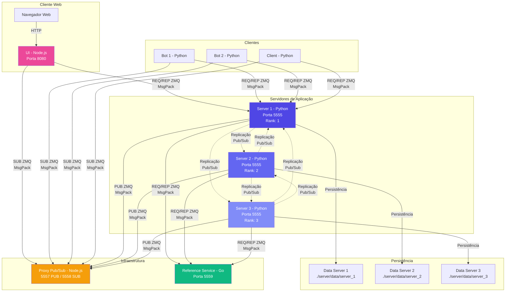
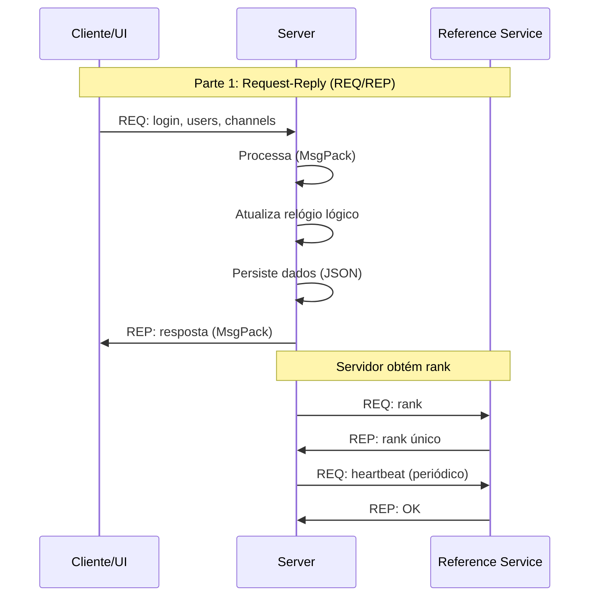
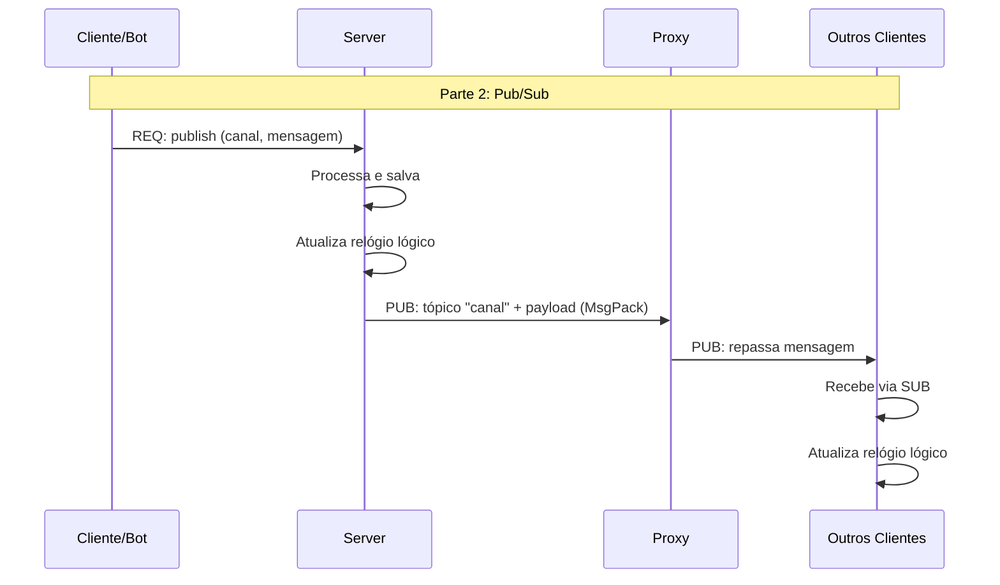
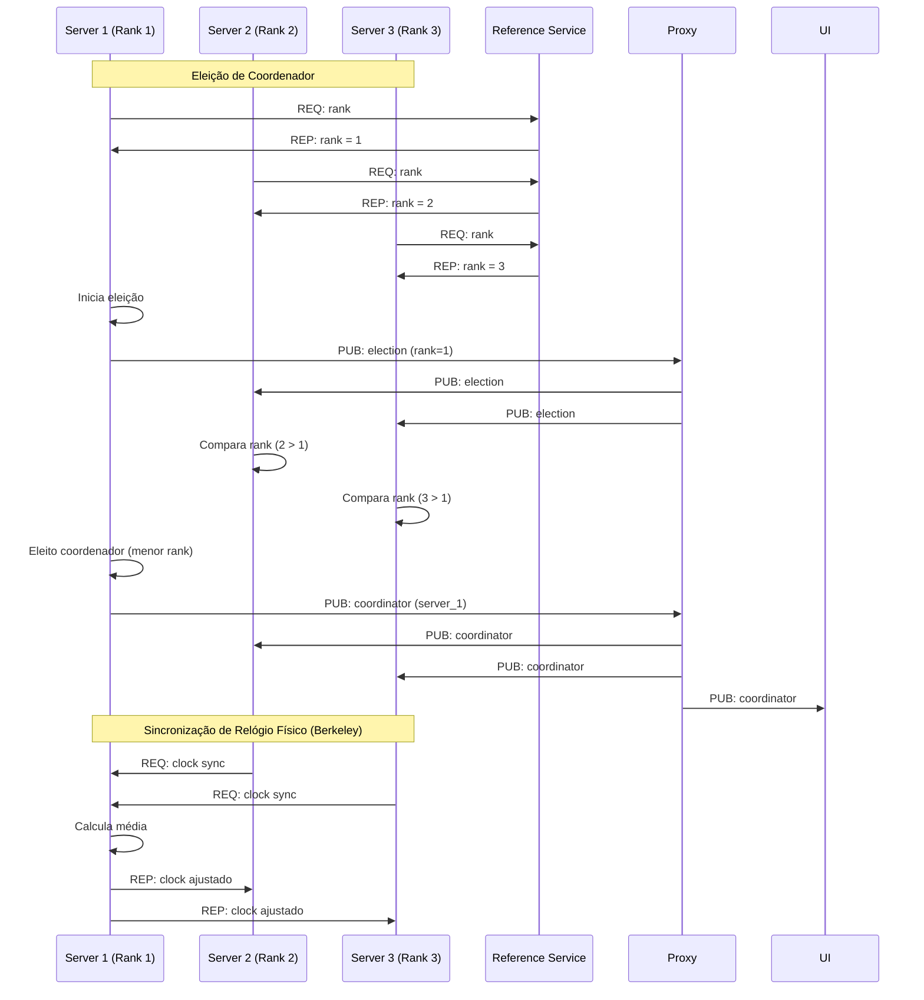
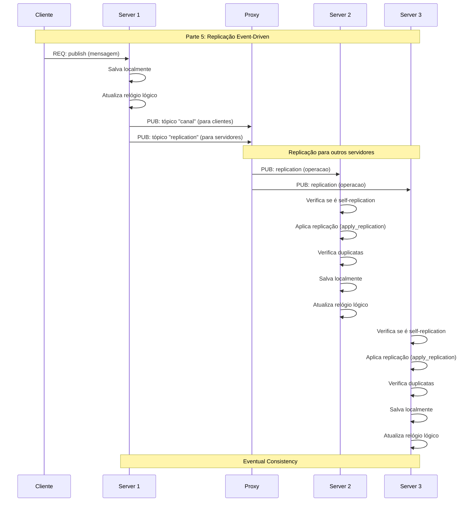
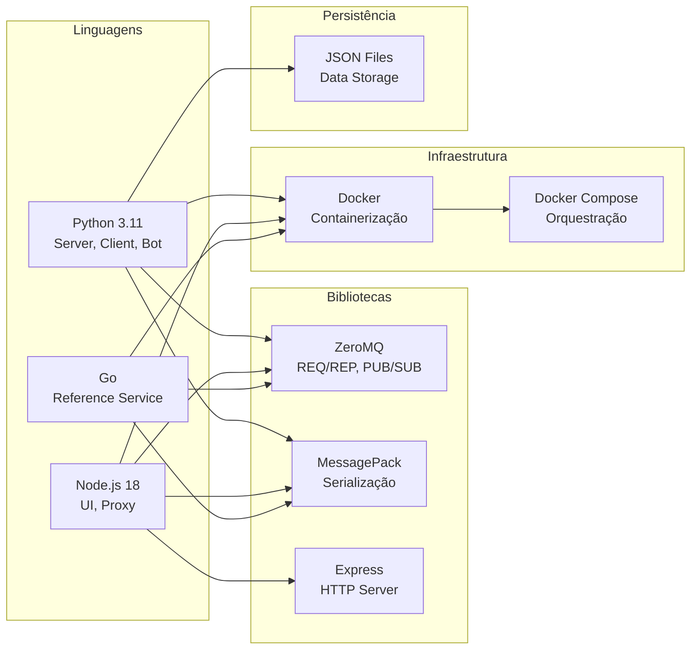

# Diagramas da Arquitetura do Sistema Distribuído

## 1. Arquitetura Geral do Sistema



## 2. Fluxo de Comunicação Request-Reply



## 3. Fluxo de Comunicação Publisher-Subscriber



## 4. Fluxo de Eleição de Coordenador



## 5. Fluxo de Replicação de Dados



## 6. Estrutura de Arquivos do Projeto

```
projeto-sistemas-distribuidos/
├── server/                    # Servidor Python
│   ├── server.py             # Servidor principal (REQ/REP + PUB/SUB)
│   ├── requirements.txt      # pyzmq, msgpack
│   ├── Dockerfile
│   └── data/                 # Dados persistidos
│       ├── server_1/
│       │   ├── data.json     # Usuários, canais, mensagens
│       │   └── login.json    # Sessões de login
│       ├── server_2/
│       │   ├── data.json
│       │   └── login.json
│       └── server_3/
│           ├── data.json
│           └── login.json
│
├── client/                    # Cliente Python (terminal)
│   ├── client.py
│   ├── requirements.txt
│   └── Dockerfile
│
├── bot/                       # Bot Python (automático)
│   ├── bot.py
│   ├── requirements.txt
│   └── Dockerfile
│
├── proxy/                     # Proxy Pub/Sub (Node.js)
│   ├── proxy.js              # Proxy XSUB/XPUB
│   ├── package.json
│   └── Dockerfile
│
├── ui/                        # Interface Web (Node.js)
│   ├── server.js             # Servidor Express + ZMQ
│   ├── package.json
│   ├── Dockerfile
│   └── public/
│       ├── index.html        # Interface HTML
│       ├── app.js            # JavaScript cliente
│       └── styles.css        # Estilos CSS
│
├── reference/                 # Serviço de Referência (Go)
│   ├── reference.go          # Gerenciamento de ranks
│   ├── go.mod
│   ├── Dockerfile
│   └── Dockerfile.debian
│
├── scripts/                   # Scripts auxiliares
│   ├── on.py                 # Inicia sistema
│   ├── off.py                # Para sistema
│   ├── test.py               # Testes automatizados
│   └── requirements.txt      # pyzmq, msgpack
│
├── docker-compose.yml         # Orquestração Docker
└── readme.md                  # Documentação
```

## 7. Componentes e Tecnologias



## 8. Portas e Protocolos

| Componente | Porta | Protocolo | Descrição |
|------------|-------|-----------|-----------|
| reference | 5559 | ZMQ REQ/REP | Serviço de referência (ranks) |
| proxy | 5557 | ZMQ PUB | Entrada de publicações |
| proxy | 5558 | ZMQ SUB | Saída para subscritores |
| server_1/2/3 | 5555 | ZMQ REQ/REP | Servidores de aplicação |
| ui | 8080 | HTTP | Interface web |
| ui | - | ZMQ REQ/REP | Comunicação com servidor |
| ui | - | ZMQ SUB | Recebe publicações |

## Resumo das Partes Implementadas

### Parte 1: Request-Reply
- ✅ Comunicação REQ/REP via ZeroMQ
- ✅ Serviços: login, users, channel, channels
- ✅ Persistência em arquivos JSON
- ✅ Serialização MessagePack

### Parte 2: Publisher-Subscriber
- ✅ Comunicação PUB/SUB via ZeroMQ
- ✅ Proxy Pub/Sub (XSUB/XPUB)
- ✅ Serviços: publish, message
- ✅ Bots automatizados

### Parte 3: MessagePack
- ✅ Serialização binária em todos os componentes
- ✅ Python: msgpack
- ✅ JavaScript: @msgpack/msgpack
- ✅ Go: github.com/vmihailenco/msgpack/v5

### Parte 4: Relógios
- ✅ Relógio lógico (Lamport) em todos os processos
- ✅ Serviço de referência (Go) para gerenciar ranks
- ✅ Sincronização de relógio físico (Algoritmo de Berkeley)
- ✅ Eleição de coordenador (menor rank)
- ✅ Heartbeat de servidores

### Parte 5: Consistência e Replicação
- ✅ Replicação de dados entre servidores
- ✅ Cada servidor possui sua própria cópia dos dados
- ✅ Replicação baseada em eventos via Pub/Sub
- ✅ Tópico "replication" para sincronização
- ✅ Prevenção de duplicatas e loops
- ✅ Eventual consistency

## Testes Automatizados

- ✅ Serviço de referência
- ✅ Status dos servidores
- ✅ Conexão do servidor
- ✅ Eleição de coordenador
- ✅ Bots em execução
- ✅ Mensagens dos bots
- ✅ Canais
- ✅ Relógio lógico
- ✅ Replicação de dados

## UI de Testes

- ✅ Interface visual para testes
- ✅ Execução via UI
- ✅ Resultados em tempo real
- ✅ Estatísticas e resumo
- ✅ Design moderno e profissional

