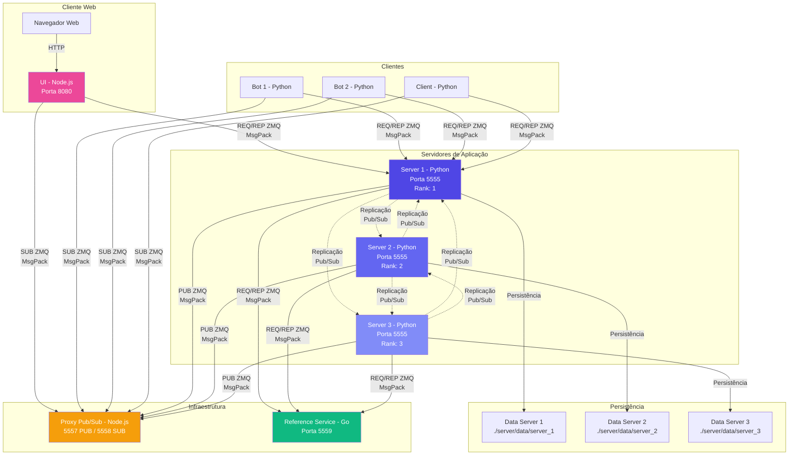

# Projeto Sistemas Distribuídos

Sistema de troca de mensagens instantâneas (BBS-like) usando ZeroMQ, MessagePack e Docker.

**Diagramas da Arquitetura**: Veja [DIAGRAMAS.md](./DIAGRAMAS.md) para diagramas detalhados da arquitetura, fluxos de comunicacao, replicacao e mais.

## Arquitetura

- **3 linguagens**: Python (servidor, cliente, bot), JavaScript/Node.js (UI, proxy), Go (serviço de referência)
- **ZeroMQ**: Request-Reply e Publisher-Subscriber
- **MessagePack**: Serialização binária de mensagens
- **Docker**: Containerização e orquestração

### Arquitetura Geral do Sistema



**Fluxos Principais:**
1. **REQ/REP**: Clientes → Servidores → Reference Service
2. **PUB/SUB**: Servidores → Proxy → Clientes
3. **Replicação**: Servidores → Proxy (tópico "replication") → Outros Servidores
4. **Eleição**: Servidores → Reference Service → Coordenador eleito

## Componentes

### Servidor (Python)
- Gerencia usuários, canais e mensagens
- Persistência em disco (JSON)
- Relógio lógico (Lamport)
- Sincronização de relógio físico (Algoritmo de Berkeley)
- Comunicação com serviço de referência

### Cliente (Python)
- Interface de terminal
- Login, listagem de usuários/canais
- Publicação em canais
- Mensagens privadas
- Relógio lógico

### Bot (Python)
- Cliente automatizado
- Envia mensagens em canais aleatórios
- Relógio lógico

### Proxy (Node.js)
- Proxy Pub/Sub para ZeroMQ
- Portas 5557 (PUB) e 5558 (SUB)

### UI (Node.js + HTML/CSS/JavaScript)
- Interface web
- Login, canais, mensagens
- Visualização de relógios lógicos
- Status de servidores e coordenador

### Serviço de Referência (Go)
- Gerencia ranks dos servidores
- Lista de servidores ativos
- Heartbeat para manter servidores ativos
- Porta 5559

## Funcionalidades

### Parte 1: Request-Reply
- ✅ Login de usuário
- ✅ Listagem de usuários
- ✅ Criação de canais
- ✅ Listagem de canais
- ✅ Persistência de dados

### Parte 2: Publisher-Subscriber
- ✅ Publicações em canais
- ✅ Mensagens privadas entre usuários
- ✅ Cliente bot automático
- ✅ Persistência de mensagens

### Parte 3: MessagePack
- ✅ Serialização binária em todos os componentes
- ✅ Python: `msgpack`
- ✅ JavaScript: `@msgpack/msgpack`
- ✅ Go: `github.com/vmihailenco/msgpack/v5`

### Parte 4: Relógios
- ✅ Relógio lógico (Lamport) em todos os processos
- ✅ Serviço de referência (Go) para gerenciar servidores
- ✅ Sincronização de relógio físico (Algoritmo de Berkeley)
- ✅ Eleição de coordenador
- ✅ Heartbeat de servidores
- ✅ Sincronização a cada 10 mensagens

### Parte 5: Consistência e Replicação
- ✅ Replicação de dados entre servidores
- ✅ Cada servidor possui sua própria cópia dos dados
- ✅ Replicação baseada em eventos via Pub/Sub
- ✅ Tópico "replication" para sincronização
- ✅ Prevenção de duplicatas e loops

## Como Executar

### Pré-requisitos
- Docker e Docker Compose
- Python 3 (para scripts auxiliares)

### Passo 1: Iniciar o sistema
```bash
python scripts/on.py
```

O script irá:
1. Limpar containers antigos
2. Fazer build das imagens
3. Subir todos os serviços (reference, proxy, servers, bots, UI)
4. Aguardar estabilização
5. **Abrir a UI automaticamente no navegador** (http://localhost:8080)

**Aguarde até o sistema estar totalmente iniciado** (o script mostrará quando estiver pronto).

### Passo 2: Testar o sistema

Você tem **duas opções** para testar:

#### Opção A: Testes via UI (Recomendado)
1. A UI já deve estar aberta no navegador (aberta automaticamente pelo `on.py`)
2. Faça login na UI
3. Vá para a aba **"Testes"** no painel de debug (parte inferior da tela)
4. Clique em **"Executar Testes"**
5. Veja os resultados na tela

#### Opção B: Testes via linha de comando
```bash
# Execute os testes (instala dependências automaticamente)
python scripts/test.py
```

**Nota:** Você deve executar o `on.py` PRIMEIRO para iniciar o sistema. Os testes só funcionam quando o sistema estiver rodando.

### Parar o sistema
```bash
python scripts/off.py
```

## Estrutura do Projeto

```
.
├── server/          # Servidor Python
│   ├── server.py
│   ├── data/        # Dados persistidos
│   └── Dockerfile
├── client/          # Cliente Python (terminal)
│   ├── client.py
│   └── Dockerfile
├── bot/             # Bot Python
│   ├── bot.py
│   └── Dockerfile
├── proxy/           # Proxy Pub/Sub (Node.js)
│   ├── proxy.js
│   └── Dockerfile
├── ui/              # Interface Web (Node.js)
│   ├── server.js
│   ├── public/
│   └── Dockerfile
├── reference/       # Serviço de Referência (Go)
│   ├── reference.go
│   └── Dockerfile
├── scripts/         # Scripts auxiliares
│   ├── on.py        # Inicia sistema
│   ├── off.py       # Para sistema
│   ├── test.py      # Testes automatizados
│   └── requirements.txt
├── docker-compose.yml
├── readme.md
└── DIAGRAMAS.md     # Diagramas da arquitetura
```

**Veja os diagramas detalhados da arquitetura em [DIAGRAMAS.md](./DIAGRAMAS.md)**

## Serviços e Portas

- **reference**: 5559 (serviço de referência)
- **proxy**: 5557 (PUB), 5558 (SUB)
- **server_1, server_2, server_3**: 5555 (REQ/REP)
- **ui**: 8080 (interface web)

## Relógios

### Relógio Lógico (Lamport)
- Implementado em cliente, bot e servidor
- Incrementado antes de enviar mensagem
- Atualizado ao receber: `max(local, received) + 1`
- Incluído em todas as mensagens

### Sincronização de Relógio Físico (Berkeley)
- Servidores sincronizam com coordenador
- Coordenador eleito automaticamente (menor rank)
- Sincronização a cada 10 mensagens processadas
- Eleição automática se coordenador falhar

## Serviço de Referência

O serviço de referência (Go) gerencia:
- **Rank**: Atribui rank único a cada servidor
- **Lista**: Retorna lista de servidores ativos
- **Heartbeat**: Mantém servidores na lista (timeout de 10s)

### Endpoints
- `rank`: Obter rank do servidor
- `list`: Listar servidores ativos
- `heartbeat`: Atualizar última atividade

## Mensagens

### Formato (MessagePack)
```json
{
  "service": "login|users|channel|channels|publish|message|...",
  "data": {
    "user": "...",
    "channel": "...",
    "message": "...",
    "timestamp": 1234567890,
    "clock": 42
  }
}
```

### Serviços
- `login`: Login de usuário
- `users`: Listar usuários
- `channel`: Criar canal
- `channels`: Listar canais
- `publish`: Publicar em canal
- `message`: Mensagem privada
- `history`: Histórico de canal
- `rank`: Obter rank (servidor → referência)
- `list`: Listar servidores (servidor → referência)
- `heartbeat`: Heartbeat (servidor → referência)
- `clock`: Sincronização de relógio (servidor → servidor)
- `election`: Eleição de coordenador (servidor → servidor)

## Testes

### Testes Manuais

1. Abra a UI em http://localhost:8080
2. Faça login
3. Crie ou entre em um canal
4. Envie mensagens
5. Envie mensagens privadas para outros usuários
6. Veja a aba "Relógios" para ver relógios lógicos e status dos servidores
7. Observe os logs dos containers para ver sincronização e eleições

### Testes Automatizados

**Importante:** O sistema deve estar rodando (via `python scripts/on.py`) antes de executar os testes.

#### Via UI (Recomendado)
1. Abra a UI em http://localhost:8080
2. Vá para a aba **"Testes"** no painel de debug
3. Clique em **"Executar Testes"**
4. Veja os resultados na tela

#### Via Linha de Comando
```bash
# O script instala dependências automaticamente
python scripts/test.py          # Modo normal (com logs)
python scripts/test.py --json   # Modo JSON (para APIs)
```

O script de testes verifica:
- ✅ Serviço de referência está respondendo
- ✅ Servidores estão rodando e respondendo
- ✅ Eleição de coordenador está funcionando
- ✅ Bots estão rodando e enviando mensagens
- ✅ Canais podem ser criados e listados
- ✅ Relógio lógico está funcionando
- ✅ Replicação de dados está funcionando

## Logs

```bash
# Ver logs de um serviço
docker compose logs -f server_1

# Ver todos os logs
docker compose logs -f

# Ver logs do serviço de referência
docker compose logs -f reference
```

## Troubleshooting

### "Aguardando eleição..." na UI

Se a UI mostra "Aguardando eleição..." por muito tempo:

1. **Verifique se os servidores têm rank:**
   ```bash
   docker compose logs reference | grep -i "rank"
   ```

2. **Verifique se a eleição aconteceu:**
   ```bash
   docker compose logs server_1 server_2 server_3 | grep -i "eleição\|election\|coordenador\|coordinator"
   ```

3. **Verifique se o anúncio foi publicado:**
   ```bash
   docker compose logs server_1 | grep -i "coordenador anunciado"
   ```

4. **Verifique se a UI está recebendo mensagens:**
   ```bash
   docker compose logs ui | grep -i "coordinator\|election"
   ```

5. **Recarregue a página da UI** - A UI tenta inferir o coordenador (servidor com menor rank) se não receber o anúncio

### Serviço de referência não compila
Se o build do serviço de referência falhar com Alpine, use a versão Debian:
1. Edite `docker-compose.yml`
2. Na seção `reference`, descomente:
   ```yaml
   dockerfile: Dockerfile.debian
   ```

### Servidores não se conectam
- Verifique se o serviço de referência está rodando
- Verifique os logs: `docker compose logs reference`
- Verifique se os servidores têm acesso à rede Docker

### Testando a Replicação

1. **Inicie o sistema**:
   ```bash
   python scripts/on.py
   ```

2. **Envie mensagens através de diferentes servidores**:
   - Mensagens enviadas via `server_1` devem aparecer no histórico de `server_2` e `server_3`
   - Verifique os logs: `docker compose logs server_1 server_2 server_3 | grep REPLICATION`

3. **Teste tolerância a falhas**:
   - Pare um servidor: `docker compose stop server_2`
   - Envie mensagens via outros servidores
   - Reinicie o servidor: `docker compose start server_2`
   - Verifique se o servidor recebeu as mensagens via replicação

4. **Verifique dados**:
   ```bash
   # Ver dados de cada servidor
   cat server/data/server_1/data.json
   cat server/data/server_2/data.json
   cat server/data/server_3/data.json
   ```

## Referências

- [ZeroMQ](https://zeromq.org/)
- [MessagePack](https://msgpack.org/)
- [Docker](https://www.docker.com/)
- [Algoritmo de Berkeley](https://en.wikipedia.org/wiki/Berkeley_algorithm)
- [Lamport Timestamps](https://en.wikipedia.org/wiki/Lamport_timestamp)
- [Event Sourcing](https://martinfowler.com/eaaDev/EventSourcing.html)